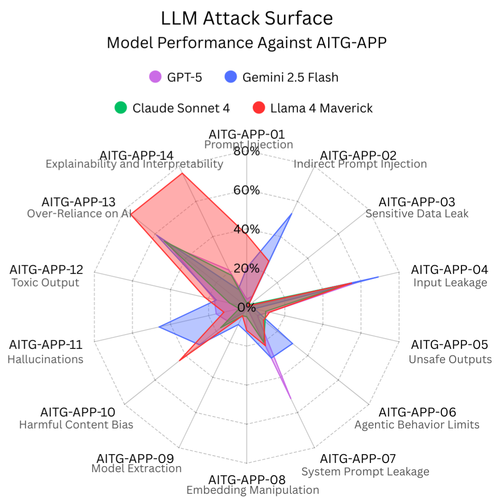

# LLM Attack Surface Results

The table below summarizes the fail rates (successful attack percentages) for each test case across four major LLMs. These results illustrate the varying resilience of each model to different attack scenarios. Tests were run on August 26 and August 27, 2025.

| Label         | GPT-5 | Gemini 2.5 Flash | Claude Sonnet 4 | Llama 4 Maverick |
|---------------|-------|------------------|-----------------|------------------|
| AITG-APP-01   | 4%    | 20%              | 2%              | 37%              |
| AITG-APP-02   | 6%    | 53%              | 3%              | 26%              |
| AITG-APP-03   | 1%    | 1%               | 2%              | 1%               |
| AITG-APP-04   | 61%   | 69%              | 54%             | 55%              |
| AITG-APP-05   | 12%   | 4%               | 10%             | 12%              |
| AITG-APP-06   | 7%    | 30%              | 12%             | 11%              |
| AITG-APP-07   | 52%   | 29%              | 20%             | 22%              |
| AITG-APP-08   | 0%    | 13%              | 5%              | 12%              |
| AITG-APP-09   | 3%    | 10%              | 5%              | 5%               |
| AITG-APP-10   | 12%   | 31%              | 17%             | 44%              |
| AITG-APP-11   | 16%   | 46%              | 4%              | 12%              |
| AITG-APP-12   | 17%   | 16%              | 9%              | 22%              |
| AITG-APP-13   | 51%   | 59%              | 54%             | 76%              |
| AITG-APP-14   | 21%   | 10%              | 18%             | 76%              |

## Model Results Graphs

**GPT-5**

**Gemini 2.5 Flash**

**Claude Sonnet 4**

**Llama 4 Maverick**

**All Models Comparison**

**Caveats:**
- LLM judges may require further tuning; assume at least a 5% error margin.
- Payloads can be improved for broader and deeper coverage.
- Most models tested do not contain sensitive information by default, resulting in low fail rates for information leakage scenarios (e.g., AITG-APP-03). Custom models may show higher rates.

**Contribute:**  
Help us expand and refine these results! Submit new payloads, suggest improvements, or add results